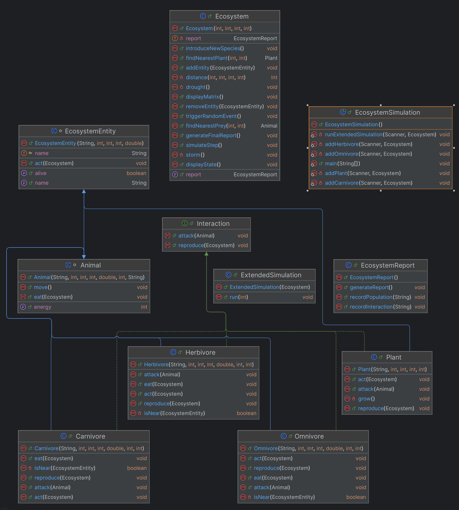

### Ecosystem Project Documentation

---

#### **1. Class and Hierarchy Description**

- **EcosystemEntity**: The base class for all entities in the ecosystem. It contains common attributes for all entities, such as name, energy, survival rate, and location (coordinates x, y). It defines basic behaviors such as life check (`isAlive()`) and actions (`act(Ecosystem ecosystem)`).

  - **Plant**: Represents a plant in the ecosystem, with methods such as `grow()` and `reproduce()`. It is added and interacts with the ecosystem in a specific way.

  - **Animal**: The base class for all animals. It implements common behaviors for animals, such as movement, eating (`eat(Ecosystem ecosystem)`), and reproduction (`reproduce(Ecosystem ecosystem)`).
    - **Carnivore**: The class for carnivores, with methods that define the hunting behavior of other animals (e.g., `attack(Animal prey)`).
    - **Herbivore**: The class for herbivores, which feed on plants in the ecosystem.
    - **Omnivore**: The class for omnivores, which can eat both plants and animals.

- **Ecosystem**: The main class that contains all entities in the ecosystem. It is responsible for managing entities, providing methods to add and remove them, identifying the nearest entities, and simulating the ecosystem’s evolution step by step.

- **EcosystemReport**: The class that generates activity reports of the ecosystem, such as populations and interactions between entities.

- **Interaction**: An interface that defines common methods for attacks and reproduction behaviors between entities.

- **EcosystemSimulation**: The class that initializes and runs the ecosystem simulation, adding various entities and updating their state step by step.

---

#### **2. Explanation of Each Method**

- **EcosystemEntity**
  - `getName()`: Returns the name of the entity.
  - `isAlive()`: Checks if the entity is still alive based on energy and survival rate.
  - `act(Ecosystem ecosystem)`: Abstract method that is implemented by derived classes to perform specific actions, such as movement, eating, or reproduction.

- **Plant**
  - `grow()`: Increases the plant’s energy.
  - `reproduce(Ecosystem ecosystem)`: Allows the plant to reproduce if it has enough energy, generating a new plant in the ecosystem.

- **Animal** (Base class)
  - `eat(Ecosystem ecosystem)`: Searches for food (plants or other animals) and increases its energy.
  - `reproduce(Ecosystem ecosystem)`: Allows the animal to reproduce if it has enough energy.
  - `move()`: Moves the entity in the ecosystem.
  

- **Carnivore**
  - `attack(Animal prey)`: Attacks a prey and consumes it, increasing its energy.

- **Herbivore**
  - `eat(Ecosystem ecosystem)`: Searches for plants and consumes them to increase its energy.
  - `reproduce(Ecosystem ecosystem)`: Allows the herbivore to reproduce, creating a new entity.

- **Omnivore**
  - `eat(Ecosystem ecosystem)`: Searches for plants or animals and consumes them.
  - `reproduce(Ecosystem ecosystem)`: Allows the omnivore to reproduce, adding a new entity to the ecosystem.

- **Ecosystem**
  - `addEntity(EcosystemEntity entity)`: Adds an entity to the ecosystem.
  - `removeEntity(EcosystemEntity entity)`: Removes an entity from the ecosystem.
  - `simulateStep()`: Performs a step in the simulation, updating the state of the ecosystem.

- **EcosystemReport**
  - `recordPopulation(String species, Long population)`: Records the population of a given species.
  - `generateReport()`: Generates and returns the ecosystem report, including populations and interactions.

- **EcosystemSimulation**
  - `addHerbivore(Scanner scanner, Ecosystem ecosystem)`: Adds a herbivore to the ecosystem.
  - `addCarnivore(Scanner scanner, Ecosystem ecosystem)`: Adds a carnivore to the ecosystem.
  - `runSimulation(int steps)`: Runs the ecosystem simulation for a specified number of steps.

- **Interaction**
  - `attack(Animal prey)`: Defines the attack behavior between two entities (e.g., carnivore attacking herbivore).
  - `reproduce(Ecosystem ecosystem)`: Defines the reproduction behavior of entities in the ecosystem.

---

#### **3. UML Diagram**

The UML diagram provides a visual representation of the structure and relationships between the classes of the project. It includes:

- **Core Classes**: `EcosystemEntity`, `Animal`, `Plant`, `Carnivore`, `Herbivore`, `Omnivore`, `Ecosystem`, `EcosystemReport`, etc.
- **Methods**: Each class has specific methods for actions, movement, eating, attacking, and reproduction, and some methods are abstract, implemented by derived classes.
- **Interactions Between Classes**: The `Ecosystem` class manages entities, while `EcosystemSimulation` runs the simulation, interacting with the classes in the ecosystem.

---

#### **4. Use Scenarios**

**Scenario 1: Creating and simulating an ecosystem with carnivores and herbivores**
1. Create an ecosystem.
2. Add a plant and a herbivore at coordinates (0, 0).
3. Add a carnivore at coordinates (1, 1).
4. The simulation begins:
  - The herbivore eats the plant and increases its energy.
  - The carnivore hunts the herbivore and increases its energy.
  - Both the herbivore and carnivore can reproduce and add new entities.
5. After several rounds, the ecosystem report can be generated to analyze populations.

**Scenario 2: Simulating an omnivorous species**
1. Create an ecosystem.
2. Add some plants and several omnivores.
3. The omnivores feed on plants and reproduce.
4. The population report will show the growth of the omnivore species.

---

#### **5. Difficulties Encountered and Adopted Solutions**

1. **Managing complex interactions between species**: One of the major difficulties was managing the correct interactions between carnivores, herbivores, and plants. The adopted solution was creating an `Interaction` interface that defines common behaviors for attacks and reproduction.

2. **Optimizing simulations in large ecosystems**: Initially, slow simulations were an issue due to repeated searches for plants and prey. The solution was to introduce efficient methods for locating entities based on coordinates, reducing the complexity of searches.

3. **Checking the life of entities**: Some entities were behaving unrealistically due to the lack of a proper life-checking mechanism. A system was implemented to validate energy and survival rates to ensure natural behaviors of entities.

---
